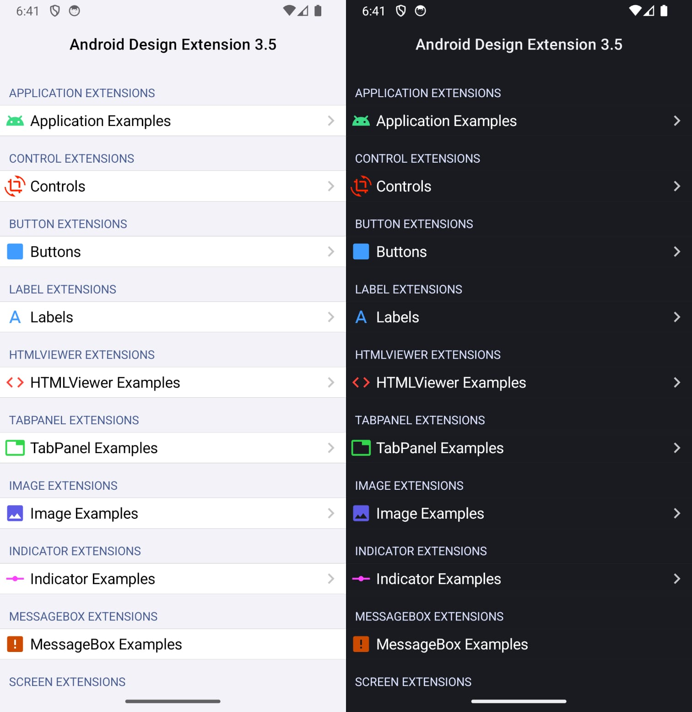

# AndroidDesignExtensions
A set of 900+ UI extensions for Xojo Android framework.

## System requirements

| **Extensions** |  **Xojo Version**                                                   |
|:--------------:|:-------------------------------------------------------------------:|
|       3.0      |  |
|       2.6      |  |
|       2.5      |  |
|       2.0      |  |
|       1.5      |  |
|       1.0      |  |

## Deprecations Version 3.0

* `AndroidMobileTable.SetDividerXC(file As FolderItem)`. Use `AndroidMobileTable.SetDividerXC(divider As Picture)` instead.
* `AndroidMobileTable.SetSelectorXC(file As FolderItem)`. Use `AndroidMobileTable. SetSelectorXC(sel As Picture)` instead.
* `MobileButton.SetIconXC(file As FolderItem)`. Use `MobileButton.SetIconXC(icon As Picture)` instead.
* `MobileUIControl.SetBackgroundXC(file As FolderItem)`. Use `MobileUIControl.SetBackgroundXC(background As Picture)` instead.
* `MobileDateTimePicker.SetIconXC(file As FolderItem)`. Use `MobileDateTimePicker.SetIconXC(icon As Picture)` instead.
* `MobileScreen.SetBackgroundXC(file As FolderItem)`. Use `MobileScreen.SetBackgroundXC(background As Picture)` instead.
* `MobileSlider.SetThumbXC(file As FolderItem)`. Use `MobileSlider.SetThumbXC(thumb As Picture)` instead.
* `MobileSwitch.SetThumbXC(file As FolderItem)`. Use `MobileSwitch.SetThumbXC(thumb As Picture)` instead.
* `MobileTextField.SetEndIconXC(file As FolderItem)`. Use `MobileTextField.SetEndIconXC(icon As Picture)` instead.
* `MobileTextField.SetErrorIconXC(file As FolderItem)`. Use  `MobileTextField. SetErrorIconXC(icon As Picture)` instead.
* `MobileTextField.SetStartIconXC(file As FolderItem)`. Use  `MobileTextField. SetStartIconXC(icon As Picture)` instead.

## Currently implemented extensions

### Color
* 181 Android System Colors
* CompositeARGBWithAlphaXC
* HarmonizeXC
* IsLightColorXC
* LayerXC

### Device
* GetUidXC

### FolderItem (SpecialFolder)
* AlarmsXC
* AudiobooksXC
* DCIMXC
* DocumentsXC
* DownloadsXC
* MoviesXC
* MusicXC
* NotificationsXC
* PicturesXC
* PodcastsXC
* RecordingsXC
* RingtonesXC
* ScreenshotsXC

### PictureXC
* PrintXC

### MobileApplication
* ClassNameXC
* DataDirXC
* DensityDpiXC
* DeviceProtectedDataDirXC
* FontScaleXC
* GetCacheDirXC
* GetCodeCacheDirXC
* GetDataDirXC
* GetExternalCacheDirXC
* GetFilesDirXC
* IsNightModeActiveXC
* IsScreenHdrXC
* IsScreenRoundXC
* IsVirtualPreloadXC
* MinSdkVersionXC
* NativeLibraryDirXC
* ProcessNameXC
* PublicSourceDirXC
* ScaleFactorXC
* ScreenHeightDpXC
* ScreenWidthDpXC
* SmallestScreenWidthDpXC
* SourceDirXC
* TargetSdkVersionXC
* TaskAffinityXC
* UidXC

### All MobileUIControls
* BringToFrontXC
* CancelLongPressXC
* CanResolveLayoutDirectionXC
* CanResolveTextAlignmentXC
* CanResolveTextDirectionXC
* CanScrollHorizontallyXC
* CanScrollVerticallyXC
* DrawIntoXC
* GetAlphaXC
* GetBaselineXC
* GetDefaultFocusHighlightEnabledXC
* GetDrawingTimeXC
* GetElevationXC
* GetFocusableXC
* GetForegroundGravityXC
* GetHorizontalFadingEdgeLengthXC
* GetIDXC
* GetImportantForAccessibilityXC
* GetImportantForAutofillXC
* GetImportantForContentCaptureXC
* GetKeepScreenOnXC
* GetLayoutDirectionXC
* GetMinimumHeightXC
* GetMinimumWidthXC
* GetOverScrollModeXC
* GetPaddingBottomXC
* GetPaddingEndXC
* GetPaddingLeftXC
* GetPaddingRightXC
* GetPaddingStartXC
* GetPaddingTopXC
* GetPivotYXC
* GetPivotYXC
* GetRevealOnFocusHintXC
* GetRotationXC
* GetRotationXXC
* GetRotationYXC
* GetScaleXXC
* GetScaleYXC
* GetScrollBarDefaultDelayBeforeFadeXC
* GetScrollBarFadeDurationXC
* GetScrollBarSizeXC
* GetScrollBarStyleXC
* GetScrollCaptureHintXC
* GetScrollIndicatorsXC
* GetScrollXXC
* GetScrollYXC
* GetTextAlignmentXC
* GetTextDirectionXC
* GetTransitionNameXC
* GetTranslationXXC
* GetTranslationYXC
* GetTranslationZXC
* GetUniqueDrawingIDXC
* GetVerticalFadingEdgeLengthXC
* GetVerticalScrollbarPositionXC
* GetX
* GetY
* GetZ
* HasExplicitFocusableXC
* HasFocusableXC
* HasFocusXC
* HasNestedScrollingParentXC
* HasOverlappingRenderingXC
* HasTransientStateXC
* HasWindowFocusXC
* IsAccessibilityFocusedXC
* IsAccessibilityHeadingXC
* IsClickableXC
* IsDuplicateParentStateEnabledXC
* IsFocusableInTouchModeXC
* IsFocusableXC
* IsFocusedByDefaultXC
* IsFocusedXC
* IsForceDarkAllowedXC
* IsHapticFeedbackEnabledXC
* IsHorizontalFadingEdgeEnabledXC
* IsHorizontalScrollBarEnabledXC
* IsImportantForAccessibilityXC
* IsImportantForAutofillXC
* IsImportantForContentCaptureXC
* IsNestedScrollingEnabledXC
* IsPaddingRelativeXC
* IsPivotSetXC
* IsScrollbarFadingEnabledXC
* IsVerticalFadingEdgeEnabledXC
* IsVerticalScrollBarEnabledXC
* SetAlphaXC
* SetBackgroundColorXC
* SetBackgroundResourceXC
* SetBackgroundXC
* SetDefaultFocusHighlightEnabledXC
* SetDuplicateParentStateEnabledXC
* SetElevationXC
* SetFadingEdgeLength
* SetFocusableInTouchModeXC
* SetFocusableXC
* SetFocusedByDefaultXC
* SetForceDarkAllowedXC
* SetForegroundGravity
* SetHapticFeedbackEnabledXC
* SetHasTransientStateXC
* SetHorizontalFadingEdgeEnabledXC
* SetHorizontalScrollBarEnabledXC
* SetImportantForAccessibilityXC
* SetImportantForAutofillXC
* SetImportantForContentCaptureXC
* SetKeepScreenOnXC
* SetLayoutDirectionXC
* SetMinimumHeightXC
* SetMinimumWidthXC
* SetNestedScrollingEnabledXC
* SetOutlineAmbientShadowColorXC
* SetOutlineSpotShadowColorXC
* SetOverScrollModeXC
* SetPaddingRelativeXC
* SetPaddingXC
* SetPivotXXC
* SetPivotYXC
* SetRevealOnFocusHintXC
* SetRotationXC
* SetRotationXXC
* SetRotationYXC
* SetScaleXXC
* SetScaleYXC
* SetScreenReaderFocusableXC
* SetScrollBarDefaultDelayBeforeFadeXC
* SetScrollBarFadeDurationXC
* SetScrollBarFadingEnabledXC
* SetScrollBarSizeXC
* SetScrollBarStyleXC
* SetScrollCaptureHintXC
* SetScrollContainerXC
* SetScrollIndicatorsXC
* SetSelectedXC
* SetSoundEffectsEnabledXC
* SetTextAlignmentXC
* SetTextDirectionXC
* SetTooltipTextXC
* SetTransitionAlphaXC
* SetTranslationXXC
* SetTranslationYXC
* SetTranslationZXC
* SetVerticalFadingEdgeEnabledXC
* SetVerticalScrollBarEnabledXC
* SetVerticalScrollBarPositionXC
* SetVerticalScrollbarThumbColor (API 29+)
* SetX
* SetY
* SetZ
* ToStringXC

### AndroidMobileTable
* AreHeaderDividersEnabledXC
* GetFirstVisiblePositionXC
* GetItemIdAtPositionXC
* GetLastVisiblePositionXC
* GetMaxScrollAmountXC
* GetSelectedItemIdXC
* GetSelectedItemPositionXC
* GetTranscriptModeXC
* GetVerticalScrollbarWidthXC
* InvalidateViewsXC
* IsFastScrollAlwaysVisibleXC
* IsFastScrollEnabledXC
* IsScrollingCacheEnabledXC
* IsSmoothScrollbarEnabledXC
* PointToPositionXC
* PointToRowIDXC
* RequestDisallowInterceptTouchEventXC
* ScrollListByXC
* SetChoiceModeXC
* SetDividerXC
* SetDrawSelectorOnTopXC
* SetFastScrollAlwaysVisibleXC
* SetFastScrollEnabledXC
* SetHeaderDividersEnabledXC
* SetItemCheckedXC
* SetScrollingCacheEnabledXC
* SetSelectionAfterHeaderViewXC
* SetSelectionFromTopXC
* SetSelectorXC
* SetSmoothScrollbarEnabledXC
* SetStackFromBottomXC
* SetTranscriptModeXC
* SmoothScrollByXC
* SmoothScrollToPositionFromTopXC
* SmoothScrollToPositionXC
* StartLayoutAnimationXC

### MobileButton / MobileDateTimePicker
* GetCornerRadiusXC
* GetIconGravityXC
* GetIconPaddingXC
* GetInsetBottomXC
* GetInsetTopXC
* GetStrokeWidthXC
* SetCornerRadiusXC
* SetIconGravityXC
* SetIconPaddingXC
* SetIconSizeXC
* SetIconTintModeXC
* SetIconTintXC
* SetIconXC
* SetInsetBottomXC
* SetInsetTopXC
* SetRippleColorXC
* SetShadowLayerXC
* SetStrokeColorXC
* SetStrokeWidthXC

### MobileContainer
* GetCurrentFocusedControlXC
* GetCurrentFocusIDXC

### MobileDateTimePicker
* PerformClickXC

### MobileHTMLViewer
* CanGoBackXC
* CanGoBackOrForwardXC
* CanGoForwardXC
* ClearCacheXC
* ClearFormDataXC
* ClearFormDataXC
* ClearHistoryXC
* ClearMatchesXC
* ClearSSLPreferencesXC
* FindAllAsyncXC
* FindNextXC
* GetAllowContentAccessXC
* GetAllowFileAccessFromFileURLsXC
* GetAllowFileAccessXC
* GetAllowUniversalAccessFromFileURLsXC
* GetBlockNetworkImageXC
* GetBlockNetworkLoadsXC
* GetBuiltInZoomControlsXC
* GetCacheModeXC
* GetContentHeightXC
* GetCursiveFontFamilyXC
* GetDefaultFixedFontSizeXC
* GetDefaultFontSizeXC
* GetDefaultTextEncodingNameXC
* GetDisabledActionModeMenuItemsXC
* GetDisplayZoomControlsXC
* GetDomStorageEnabledXC
* GetFantasyFontFamilyXC
* GetFixedFontFamilyXC
* GetJavaScriptCanOpenWindowsAutomaticallyXC
* GetJavaScriptEnabledXC
* GetLoadsImagesAutomaticallyXC
* GetLoadWithOverviewModeXC
* GetMediaPlaybackRequiresUserGestureXC
* GetMinimumFontSizeXC
* GetMinimumLogicalFontSizeXC
* GetMixedContentModeXC
* GetOffscreenPreRasterXC
* GetOriginalUrlXC
* GetProgressXC
* GetRendererPriorityWaivedWhenNotVisibleXC
* GetRendererRequestedPriorityXC
* GetSansSerifFontFamilyXC
* GetSerifFontFamilyXC
* GetStandardFontFamilyXC
* GetTextZoomXC
* GetTitleXC
* GetUrlXC
* GetUserAgentStringXC
* GetUseWideViewPortXC
* GoBackOrForwardXC
* GoBackXC
* GoForwardXC
* InvokeZoomPickerXC
* IsAlgorithmicDarkeningAllowedXC
* IsPrivateBrowsingEnabledXC
* PageDownXC
* PageUpXC
* PrintXC
* ReloadXC
* SaveAsWebArchiveXC
* SetAlgorithmicDarkeningAllowedXC
* SetAllowContentAccessXC
* SetAllowFileAccessXC
* SetBlockNetworkImageXC
* SetBlockNetworkLoadsXC
* SetBuiltInZoomControlsXC
* SetCacheModeXC
* SetDefaultFixedFontSizeXC
* SetDefaultFontSizeXC
* SetDefaultTextEncodingNameXC
* SetDisabledActionModeMenuItemsXC
* SetDisplayZoomControlsXC
* SetDomStorageEnabledXC
* SetFantasyFontFamilyXC
* SetFixedFontFamilyXC
* SetGeolocationEnabledXC
* SetInitialScaleXC
* SetJavaScriptCanOpenWindowsAutomaticallyXC
* SetJavaScriptEnabledXC
* SetLoadsImagesAutomaticallyXC
* SetLoadWithOverviewModeXC
* SetMediaPlaybackRequiresUserGestureXC
* SetMinimumFontSizeXC
* SetMinimumLogicalFontSizeXC
* SetMixedContentModeXC
* SetNeedInitialFocusXC
* SetNetworkAvailableXC
* SetOffscreenPreRasterXC
* SetSafeBrowsingEnabledXC
* SetSansSerifFontFamilyXC
* SetSerifFontFamilyXC
* SetStandardFontFamilyXC
* SetSupportMultipleWindowsXC
* SetSupportZoomXC
* SetTextZoomXC
* SetUserAgentStringXC
* SetUseWideViewPortXC
* StopLoadingXC
* SupportZoomXC
* ZoomByXC
* ZoomInXC
* ZoomOutXC

### MobileImageViewer
* ClearColorFilterXC
* GetAdjustViewBoundsXC
* GetCropToPaddingXC
* GetImageAlphaXC
* HasOverlappingRenderingXC
* IsOpaqueXC
* SetAdjustViewBoundsXC
* SetColorFilterXC
* SetCropToPaddingXC
* SetImageAlphaXC

### MobileLabel
* GetInputTypeXC
* GetShowSoftInputOnFocusXC
* SetInputTypeXC
* SetErrorXC
* SetShadowLayerXC
* SetShowSoftInputOnFocusXC
* SetTextIsSelectableXC

### MobileMoviePlayer
* CanPauseXC
* CanSeekBackwardXC
* CanSeekForwardXC
* GetBufferPercentageXC
* GetCurrentPositionXC
* IsPlayingXC
* ResolveAdjustedSizeXC
* ResumeXC
* SeekToXC
* SetAudioFocusRequestXC
* StopPlaybackXC
* SuspendXC

### MobileProgressBar
* GetSecondaryProgressXC
* IncrementProgressByXC
* IncrementSecondaryProgressByXC
* IsAnimatingXC
* IsIndeterminateXC
* SetIndeterminateXC
* SetProgressBackgroundTintListXC
* SetProgressTintListXC
* SetProgressXC
* SetSecondaryProgressXC
* SetTintXC

### MobilePopupMenu (Xojo 2023r3+)
* GetDropDownHorizontalOffsetXC
* GetDropDownVerticalOffsetXC
* GetDropDownWidthXC
* PerformClickXC
* SetDropDownHorizontalOffsetXC
* SetDropDownVerticalOffsetXC
* SetDropDownWidthXC

### MobileScreen
* DrawIntoXC
* GetBoundsXC
* GetCurrentFocusedControlXC
* GetCurrentFocusIDXC
* GetDensityXC
* GetDisplayIDXC
* GetDisplayRotationXC
* GetDisplayStateXC
* GetHeightXC
* GetNavigationBarColorXC
* GetRequestedOrientationXC
* GetStatusBarColorXC
* GetSystemBarsAppearanceXC
* GetSystemBarsBehaviorXC
* GetSystemUiVisibilityXC
* GetTransitionBackgroundFadeDurationXC
* GetWidthXC
* IsDisplayHdrXC
* IsLocalVoiceInteractionSupportedXC
* IsOverflowMenuShowingXC
* IsTitleCenteredXC
* MoveTaskToBackXC
* RequestShowKeyboardShortcutsXC
* SetBackgroundBlurRadiusXC
* SetBackgroundColorXC
* SetBackgroundResourceXC
* SetBackgroundXC
* SetBottomAppBarBackgroundColorXC
* SetContentInsetsAbsoluteXC
* SetContentInsetsRelativeXC
* SetContentInsetStartWithNavigationXC
* SetDecorCaptionShadeXC
* SetDecorFitsSystemWindowsXC
* SetDimAmountXC
* SetElevationXC
* SetInheritShowWhenLockedXC
* SetLayoutXC
* SetLogoDescriptionXC
* SetLogoXC
* SetMaterialToolbarBackgroundColorXC
* SetMaterialToolbarBackgroundXC
* SetMaterialToolbarElevationXC
* SetNavigationBarColorXC
* SetNavigationBarContrastEnforcedXC
* SetNavigationBarDividerColorXC
* SetNavigationContentDescriptionXC
* SetNavigationIconXC
* SetOverflowIconXC
* SetRequestedOrientationXC
* SetShowWhenLockedXC
* SetStatusBarColorXC
* SetStatusBarContrastEnforcedXC
* SetSystemBarsAppearanceXC
* SetSystemBarsBehaviorXC
* SetSystemUiVisibilityXC
* SetTitleCenteredXC
* SetTitleMarginStartXC
* SetTitleTextColorXC
* SetTitleTextFontXC
* SetTitleTextSizeXC
* SetTransitionBackgroundFadeDurationXC
* SetTranslucentXC
* SetTurnScreenOnXC
* SetWindowInsetsTypeHideXC
* SetWindowInsetsTypeShowXC
* ShowLockTaskEscapeMessageXC
* ShowOverflowMenuXC
* StartLockTaskXC
* StopLockTaskXC

### MobileScrollableArea
* GetChildCountXC
* GetChildDrawingOrderXC
* GetMaxScrollAmountXC
* GetNestedScrollAxesXC
* HasNestedScrollingParentXC
* IsFillViewportXC
* IsNestedScrollingEnabledXC
* IsSmoothScrollingEnabledXC
* PageScrollXC
* RemoveAllViews
* RemoveViewAtXC
* RemoveViewsXC
* ScrollToXC
* SetFillViewportXC
* SetNestedScrollingEnabledXC
* SetSmoothScrollingEnabledXC
* SmoothScrollByXC
* SmoothScrollToXC
* StartNestedScrollXC
* StopNestedScrollXC

### MobileSegmentedButton
* ClearCheckedXC
* RemoveSegmentsInRangeXC
* SetBackgroundColorAtXC
* SetSelectionRequiredXC
* SetSingleSelectionXC

### MobileSlider / MobileSwitch
* SetThumbColorXC
* SetThumbXC

### MobileSlider
* SetProgressBackgroundTintListXC
* SetProgressTintListXC
* SetTintXC

### MobileSwitch
* IsUseMaterialThemeColorsXC
* SetTrackColorXC
* SetUseMaterialThemeColorsXC

### MobileTabPanel
* ClearBadgeNumberAtXC
* ClearBadgeTextAtXC
* GetBadgeAlphaAtXC
* GetBadgeBackgroundColorAtXC
* GetBadgeGravityAtXC
* GetBadgeHorizontalOffsetAtXC
* GetBadgeHorizontalOffsetWithoutTextAtXC
* GetBadgeHorizontalOffsetWithTextAtXC
* GetBadgeHorizontalPaddingAtXC
* GetBadgeMaxCharacterCountAtXC
* GetBadgeMaxNumberAtXC
* GetBadgeNumberAtXC
* GetBadgeOpacityAtXC
* GetBadgeTextAtXC
* GetBadgeTextColorAtXC
* GetBadgeVerticalOffsetAtXC
* GetBadgeVerticalOffsetWithoutTextAtXC
* GetBadgeVerticalOffsetWithTextAtXC
* GetBadgeVerticalPaddingAtXC
* GetTabIndicatorAnimationModeXC
* GetTabIndicatorGravityXC
* GetTabModeXC
* HasBadgeNumberAtXC
* HasBadgeTextAtXC
* HasUnboundedRippleXC
* IsInlineLabelXC
* IsTabIndicatorFullWidthXC
* RemoveBadgeAtXC
* SetAutoAdjustToWithinGrandparentBoundsXC
* SetBadgeAlphaAtXC
* SetBadgeBackgroundColorAtXC
* SetBadgeContentDescriptionForTextAtXC
* SetBadgeContentDescriptionNumberlessXC
* SetBadgeGravityAtXC
* SetBadgeHorizontalOffsetAtXC
* SetBadgeHorizontalOffsetWithoutTextAtXC
* SetBadgeHorizontalOffsetWithTextAtXC
* SetBadgeHorizontalPaddingAtXC
* SetBadgeLargeFontVerticalOffsetAdjustmentXC
* SetBadgeMaxCharacterCountAtXC
* SetBadgeMaxNumberAtXC
* SetBadgeNumberAtXC
* SetBadgeTextAtXC
* SetBadgeTextColorAtXC
* SetBadgeVerticalOffsetAtXC
* SetBadgeVerticalOffsetWithoutTextAtXC
* SetBadgeVerticalOffsetWithTextAtXC
* SetBadgeVerticalPaddingAtXC
* SetInlineLabelXC
* SetScrollPositionXC
* SetSelectedTabIndicatorColorXC
* SetSelectedTabIndicatorGravityXC
* SetTabBackgroundColorAtXC
* SetTabGravityXC
* SetTabIndicatorAnimationModeXC
* SetTabIndicatorFullWidthXC
* SetTabModeXC
* SetTabTextColorsXC
* SetUnboundedRippleXC
* SetUserInputEnabledXC

### MobileTextArea / MobileTextField
* AppendXC
* GetInputTypeXC
* HasSelectionXC
* IsCursorVisibleXC
* IsTextSelectableXC
* SetElegantTextHeightXC
* SetErrorXC
* SetHighlightColorXC
* SetLetterSpacingXC
* SetSelectedXC
* SetSelectionXC
* SetShadowLayerXC
* SetShowSoftInputOnFocusXC
* SetTextIsSelectableXC

### MobileTextArea
* GetAutoLinkMaskXC
* GetBottomPaddingXC
* GetBreakStrategyXC
* GetCompoundDrawablePaddingXC
* GetCompoundPaddingBottomXC
* GetCompoundPaddingEndXC
* GetCompoundPaddingLeftXC
* GetCompoundPaddingRightXC
* GetCompoundPaddingStartXC
* GetExtendedPaddingBottomXC
* GetExtendedPaddingTopXC
* GetFirstBaselineToTopHeightXC
* GetHighlightColorXC
* GetHintTextColorXC
* GetHyphenationFrequencyXC
* GetImeOptionsXC
* GetIncludeFontPaddingXC
* GetJustificationModeXC
* GetLastBaselineToBottomHeightXC
* GetLineAscentXC
* GetLineBaselineXC
* GetLineBottomXC
* GetLineContainsTabXC
* GetLineCountXC
* GetLineDescentXC
* GetLineEndXC
* GetLineForOffsetXC
* GetLineForVerticalXC
* GetLineHeightXC
* GetLineLeftXC
* GetLineMaxXC
* GetLineRightXC
* GetLineStartXC
* GetLineTopXC
* GetLineVisibleEndXC
* GetLineWidthXC
* GetLinksClickableXC
* GetLinkTextColorXC
* GetMaxLinesXC
* GetMinLinesXC
* GetOffsetForHorizontalXC
* GetOffsetToLeftOfXC
* GetOffsetToRightOfXC
* GetPaintFlagsXC
* GetParagraphDirectionXC
* GetParagraphLeftXC
* GetParagraphRightXC
* GetPrimaryHorizontalXC
* GetSecondaryHorizontalXC
* GetShowSoftInputOnFocusXC
* GetSpacingAddXC
* GetSpacingMultiplierXC
* GetTopPaddingXC
* GetTotalPaddingBottomXC
* GetTotalPaddingEndXC
* GetTotalPaddingLeftXC
* GetTotalPaddingRightXC
* GetTotalPaddingStartXC
* GetTotalPaddingTopXC
* IsRtlCharAtXC
* SetAllCapsXC
* SetAutoLinkMaskXC
* SetBreakStrategyXC
* SetCompoundDrawablePaddingXC
* SetCursorVisibleXC
* SetFallbackLineSpacingXC
* SetFirstBaselineToTopHeightXC
* SetGravityXC
* SetHintXC
* SetHintTextColorXC
* SetHorizontallyScrollingXC
* SetHyphenationFrequencyXC
* SetImeOptionsXC
* SetIncludeFontPaddingXC
* SetInputTypeXC
* SetJustificationModeXC
* SetLastBaselineToBottomHeightXC
* SetLineHeightXC
* SetLineSpacingXC
* SetLinesXC
* SetLinksClickableXC
* SetLinkTextColorXC
* SetMaxLinesXC
* SetMinLinesXC
* SetPaintFlagsXC
* SetRawInputTypeXC
* SetSelectAllOnFocusXC
* SetSingleLineXC
* SetTextFromHtmlXC
* SetTextScaleXXC

### MobileTextField
* GetBoxBackgroundColorXC
* GetBoxBackgroundModeXC
* GetBoxCornerRadiusBottomEndXC
* GetBoxCornerRadiusBottomStartXC
* GetBoxCornerRadiusTopEndXC
* GetBoxCornerRadiusTopStartXC
* GetBoxStrokeColorXC
* GetBoxStrokeWidthFocusedXC
* GetBoxStrokeWidthXC
* GetCounterMaxLengthXC
* GetEndIconContentDescriptionXC
* GetEndIconModeXC
* GetErrorCurrentTextColorsXC
* GetErrorXC
* GetHelperTextCurrentTextColorXC
* GetHelperTextXC
* GetPrefixTextXC
* GetStartIconContentDescriptionXC
* GetSuffixTextXC
* IsCounterEnabledXC
* IsEndIconCheckableXC
* IsEndIconVisibleXC
* IsErrorEnabledXC
* IsExpandedHintEnabledXC
* IsHelperTextEnabledXC
* IsHintAnimationEnabledXC
* IsHintEnabledXC
* IsStartIconCheckableXC
* IsStartIconVisibleXC
* SetBoxBackgroundColorXC
* SetBoxBackgroundModeXC
* SetBoxCornerFamilyXC
* SetBoxCornerRadiiXC
* SetBoxStrokeColorXC
* SetBoxStrokeErrorColorXC
* SetBoxStrokeWidthFocusedXC
* SetBoxStrokeWidthXC
* SetCounterEnabledXC
* SetCounterMaxLengthXC
* SetCounterOverflowTextColorXC
* SetCounterTextColorXC
* SetCursorColorXC
* SetCursorErrorColorXC
* SetDefaultHintTextColorXC
* SetEndIconActivatedXC
* SetEndIconCheckableXC
* SetEndIconContentDescriptionXC
* SetEndIconMinSizeXC
* SetEndIconModeXC
* SetEndIconTintListXC
* SetEndIconTintModeXC
* SetEndIconVisibleXC
* SetEndIconXC
* SetErrorContentDescriptionXC
* SetErrorEnabledXC
* SetErrorTextColorXC
* SetExpandedHintEnabledXC
* SetHelperTextColorXC
* SetHelperTextEnabledXC
* SetHelperTextXC
* SetHintAnimationEnabledXC
* SetHintEnabledXC
* SetHintTextColorXC
* SetHintXC
* SetInputTypeXC
* SetPlaceholderTextColorXC
* SetPrefixTextColorXC
* SetPrefixTextXC
* SetStartIconCheckableXC
* SetStartIconContentDescriptionXC
* SetStartIconMinSizeXC
* SetStartIconTintListXC
* SetStartIconTintModeXC
* SetStartIconVisibleXC
* SetStartIconXC
* SetSuffixTextColorXC
* SetSuffixTextXC
* SetTintXC (API 29+)

## ToDo

Copy-paste the AndroidDesignExtensions Folder into your project.

Feel free to ask for feature requests!

Made with ❤️ in Austria
